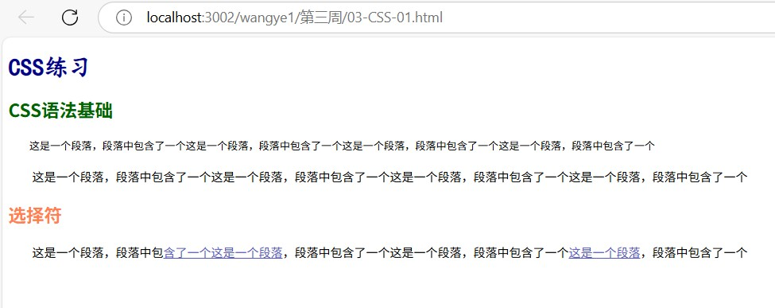
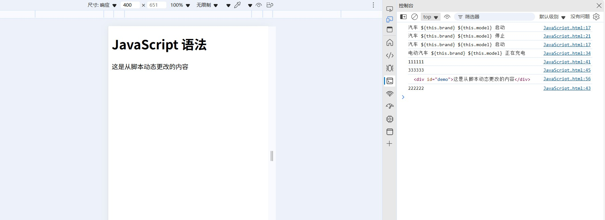

# Web前端开发课程练习平台

## 项目简介

《Web 前端开发》课程练习平台，依托课程沉淀成果，覆盖 HTML、CSS、JavaScript 及框架等核心知识。从基础语法到框架应用，通过 HTML 结构、CSS 样式与布局、JavaScript 交互及异步编程，再到 Next.js 框架实践，构建体系化练习路径。基于 Next.js 、Tailwind CSS 开发，借 Wakatime 统计时长，提供 “查看练习”“收藏” 功能，搭配 AI 助手、问答模块。以项目化实践推动知识落地，从理论到实操进阶，适配学习与求职技术验证，串联全栈技术。平台部署在[http://192.168.56.249:3002](http://192.168.56.249:3002)，可通过此地址访问。

## QAnything集成路径与实现细节

### 集成路径

1. 知识准备：搜集相关内容，编写结构化文档，作为 AI 回答的依据。

2. 平台注册与配置：
   - 登陆 / 注册 QAnything 账号。
   - 新建知识库。

3. 创建智能 Agent：
   - 在 QAnything 平台创建专用 Agent。

4. 配置 Agent 参数：设置回答风格、知识深度。

5. 知识关联与优化：

6. 发布与嵌入：
   - 保存 Agent 设定，发布至生产环境。
   - 在 QAnything 平台生成网页嵌入代码
   - 将代码嵌入课程平台的网站。
### 选择路径原因

- 知识定制化：通过独立知识库管理内容，确保 AI 回答与知识库体系强相关。
- 品牌一致性：创建专用 Agent 可定制回答风格，与课程平台的技术定位统一，提升用户体验。
- 可控性与优化：独立 Agent 便于后续根据用户提问数据优化知识库（如添加高频问题、修正回答偏差），持续提升回答准确性。
- 轻量化集成：网页嵌入方式无需改造现有课程平台架构，可快速实现 AI 问答功能，降低技术成本。
### 实现细节

- 知识库构建要点：按课程模块分类，设计标准问答对，例如：
  ```
  Q："如何实现CSS响应式布局？"
  A："可使用媒体查询（@media）结合flexbox或grid布局，示例代码：..."
  ```
- Agent参数配置：限制回答长度为中等，定期更新知识截止日期，确保内容包含最新前端技术。
- 前端嵌入方案：iframe样式适配课程平台主题，添加交互提示，点击展开AI问答面板。

### QAnything运行截图


图注：QAnything嵌入页面底部，可随时点击展开AI问答面板进行技术咨询。

## WakaTime API集成方法

### 集成步骤

1. 登录 Cloudflare Dashboard。
2. 导航到 “Workers & Pages”。
3. 点击 “Create application”，然后选择 “Create Worker”。
4. 给您的 Worker 一个唯一的名称 (例如 4.wakatime-api-proxy)，然后点击 “Deploy”。
5. 点击 “Edit code” 进入在线编辑器。
6. 打开 src/index.js (或您在 Dashboard 中编辑的文件)，并替换内容。
7. 部署。
8. 打开设置——变量和机密——编辑——变量名称 `WAKATIME_API_KEY`——输入值——部署。
9. 部署成功后，Wrangler 会输出Worker URL，更换地址。

### 实现代码示例

```javascript
   // 替换为项目总时长 API 端点
                const apiUrl = `https://csc-wakatime.wemedia.press/`;
                const response = await fetch(apiUrl);
                if (!response.ok) {
                    const errorData = await response.json().catch(() => ({ message: "解析错误响应失败" }));
                    throw new Error(errorData.message || `请求失败：${response.status}`);
                }
```

### WakaTime API集成与展示截图


图注：项目首页底部显示总编码时长为31.92小时，实时统计用户的前端学习时长。

## Next.js项目结构

```
project-root
├── pages
│   ├── index.js // 首页
│   ├── practice
│   │   ├── html.js // HTML练习页面
│   │   ├── css.js // CSS练习页面
│   │   ├── javascript.js // JavaScript练习页面
│   │   ├── nextjs.js // Next.js练习页面
│   │   └──...
│   └──...
├── components
│   ├── Navbar.js // 导航栏组件
│   ├── Footer.js // 页脚组件
│   ├── PracticeItem.js // 练习项组件
│   └──...
├── public
│   ├── images
│   │   └──...
│   └──...
├── styles
│   ├── globals.css // 全局样式
│   ├── practice.module.css // 练习页面样式
│   └──...
├── utils
│   ├── wakatime.js // WakaTime API调用工具函数
│   └──...
├── next.config.js // Next.js配置文件
├── package.json
└── README.md
```

- pages目录：存放页面组件，对应网站路由。
- components目录：存放可复用的组件，如导航栏、页脚等。
- public目录：用于存放静态资源，如图片、字体等。
- styles目录：管理项目样式，采用模块化CSS。
- utils目录：存放工具函数，如WakaTime API调用逻辑。

## 旧作业整合方式

1. 分析旧作业：梳理旧作业的技术点与内容，确定整合优先级。
2. 模块化改造：将旧作业代码封装为独立组件或页面，确保与现有项目技术栈兼容。
3. 路由添加：在Next.js的pages目录中创建对应路由，将旧作业页面纳入项目导航体系。
4. 样式适配：调整旧作业样式，使其符合项目整体风格，使用Tailwind CSS或项目现有样式方案。

## 项目运行指南

### 环境要求

- Node.js（建议版本14及以上）
- npm或yarn

### 安装依赖

```bash
# 使用npm
npm install

# 使用yarn
yarn install
```

### 配置环境变量

在项目根目录创建`.env.local`文件，配置WakaTime API Key：

```
WAKATIME_API_KEY=your_api_key_here
```

### 启动项目

```bash
# 使用npm
npm run dev

# 使用yarn
yarn dev
```

项目启动后，访问[http://localhost:3002](http://localhost:3002)即可在浏览器中查看运行效果。

### Next.js组织课程练习作业的运行截图

练习导航页截图


图注：展示课程练习分类导航，包含HTML、CSS、JavaScript、Next.js等多个技术方向的练习。

具体练习运行界面截图


图注：以HTML练习页面为例

图注：以CSS基础练习页面为例。


图注：以CSS盒模型与布局练习页面为例。


图注：以JavaScript DOM 操作练习页面为例。

图注：以添加JavaScript语法示例练习页面为例。


图注：以JavaScript异步编程练习页面为例。

图注：以Next.js核心概念练习页面为例。
